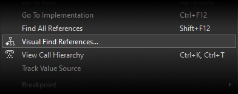
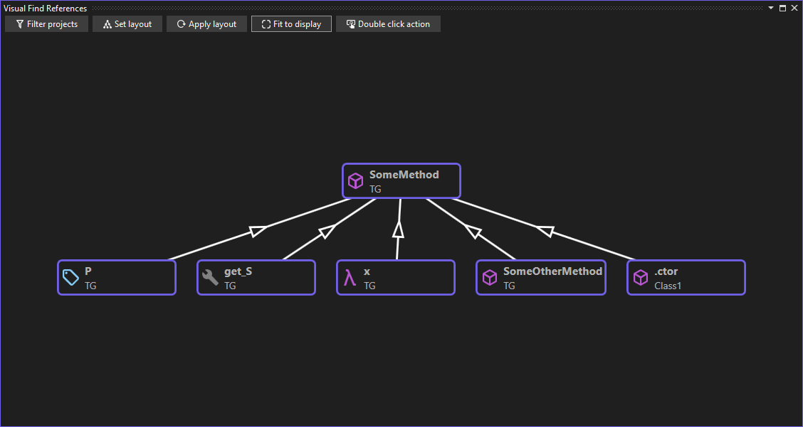
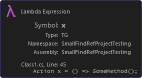
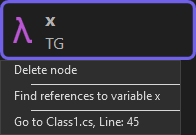
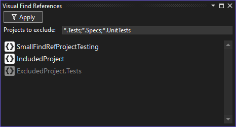

# Getting Started 🚗

After installation, you can access the functionality of the extension through the code editor context menu:

This will show the Visual Find References tool window:

## The graph display 📈️

From the graph display you can drag nodes, highlight them and delete them, as you would expect.

If you hover over a node, you will get more detail:

The buttons at the top cover filtering (described below), setting the layout algorithm, re-applying the layout algorithm (only really useful for the force-directed algorithm), fitting the graph to the display bounds and setting the action when you double click.

Note that you can set the default filter, layout algorithm and double click action by going to Tools->Options->Visual Find References in Visual Studio.

## The graph node context menu ☝

When right clicking on a node on the graph, you get the node context menu:

The options available are to delete the node, find references or go to the reference location.

## Filtering 🎛

Visual Find References allows you to filter out projects from which you don't want to find references. When exploring a new code base for the first time to understand the flow, you may not want to see references from unit test projects. To filter out references, click on the 'Filter projects' button on the graph display.

This will show the filtering UI:

 
 
Just enter a search pattern, using `*` and `?` as wildcards. The faded projects will not be included in searches.

Note that filtering does not affect the already-displayed graph, just any further searches that are performed.

## Containers and navigation 🧭

When navigating a graph, you find references to members or types. Those references are present in the code, often in the scope of a method or similar.

When you want to find the next set of references, it is the container of the reference that is searched for.

By way of example, say we want to find references to a method called 'MyMethod'. We find a reference in the code for the method 'YourMethod'. When searching for further references, we search for the container ('YourMethod') rather than the line of code within the method.

There are several different types of contains (methods, field references, property accessors, etc.) - although it is usually the case that reference chains go from method to method.

### Multiple navigation nodes

Some nodes allow you to choose how you navigating. Say you have a field that has an initializer that calls 'MyMethod' from the example above. In this circumstance, you are presented with the option to find all references to the field - or to find all references to constructions of the type that contains the field.